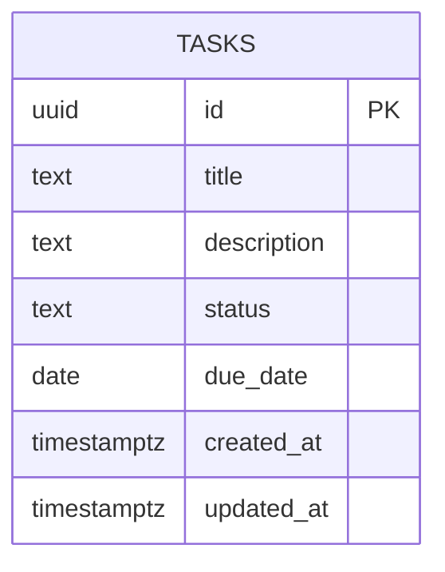

# Database Design (ERD) — Task board for one person

Engine: PostgreSQL 16
Last updated: 2026-08-17
Source requirements: `docs/tasks/SRS.md`

## 1. Overview

This schema stores one aggregate root: tasks. It supports one single-person board with persisted title, optional description, workflow status, and optional date-only due date behind REST API.

Deliberately not stored: users, accounts, sessions, boards, assignments, comments, labels, tags, activity log, files, search indexes, notifications, browser-storage state, or multi-project data.

## 2. Diagram



Cardinality notation: no relationships exist in current scope. One table only, per SRS and architecture.

## 3. Entities

### 3.1 `tasks`

**Purpose** — Stores persisted task cards for one board. **Traces to** — TASKS-001, TASKS-002, TASKS-003, TASKS-004, TASKS-005.

| Column | Type | Null | Default | Unique | Description |
|---|---|---|---|---|---|
| `id` | `uuid` | no | `gen_random_uuid()` | PK | Stable task identifier used by edit, move, and delete API actions. |
| `title` | `text` | no | none | no | Required task title, stored after trimming; 1 to 120 characters. |
| `description` | `text` | yes | none | no | Optional task description, stored after trimming; absent when blank, maximum 2,000 characters. |
| `status` | `text` | no | `'todo'` | no | Workflow status: `todo`, `doing`, or `done`. |
| `due_date` | `date` | yes | none | no | Optional calendar due date with no time of day. |
| `created_at` | `timestamptz` | no | `now()` | no | Row creation timestamp, UTC. |
| `updated_at` | `timestamptz` | no | `now()` | no | Last database write timestamp, UTC. |

**Nullable columns**

- `description` — absence means Board owner left description blank; SRS says description is optional and blank is displayed as absent.
- `due_date` — absence means no due date was chosen; SRS says due date is optional and blank is displayed as absent.

**Foreign keys**

| Column | References | On delete | On update | Why |
|---|---|---|---|---|
| none | none | n/a | n/a | One-table product; no parent entities exist in scope. |

**Constraints**

- `ck_tasks_title_length` — `length(title) BETWEEN 1 AND 120`; enforces TASKS-001/002/003 title rule after application trimming.
- `ck_tasks_description_length` — `description IS NULL OR length(description) <= 2000`; enforces TASKS-001/002/003 optional description rule.
- `ck_tasks_status` — `status IN ('todo', 'doing', 'done')`; prevents invalid persisted statuses and fourth-column data.

**Indexes**

| Name | Columns | Type | Query it serves |
|---|---|---|---|
| `idx_tasks_status_created_at` | `status`, `created_at` | btree | List tasks grouped by status with stable within-column ordering for TASKS-001 and status counts for TASKS-004. |

**Lifecycle** — hard delete. TASKS-005 requires deleted tasks disappear from Postgres-backed reloads, and no audit/reporting requirements need soft delete.

## 4. Enumerations

| Name | Values | Mechanism | Why |
|---|---|---|---|
| `task_status` | `todo`, `doing`, `done` | `CHECK` constraint on `tasks.status` | Values change only by deployment if scope changes; lookup table and pg enum add cost without need. |

## 5. Access patterns

| # | Pattern | Frequency | Index used |
|---|---|---|---|
| 1 | `SELECT id, title, description, status, due_date, created_at, updated_at FROM tasks ORDER BY status, created_at` for board load. | Every page load and refresh retry. | `idx_tasks_status_created_at` |
| 2 | `SELECT count(*) FROM tasks GROUP BY status` or app-side counts from board load result. | Every board load; after move/delete can be app-side from returned list/state. | `idx_tasks_status_created_at` when DB-side count used. |
| 3 | `SELECT ... FROM tasks WHERE id = $1` before edit/move/delete or returning not-found. | Every edit, move, and delete action. | Primary key index on `id`. |
| 4 | `INSERT INTO tasks (...) VALUES (...) RETURNING ...` for create. | User action. | No extra index; primary key handles identity. |
| 5 | `UPDATE tasks SET ... WHERE id = $1 RETURNING ...` for edit/move. | User action. | Primary key index on `id`. |
| 6 | `DELETE FROM tasks WHERE id = $1` for delete. | User action. | Primary key index on `id`. |

## 6. Data volume and growth

| Table | Rows at launch | Growth | Retention |
|---|---|---|---|
| `tasks` | 0 | Low; single-person board, likely under hundreds per month. | Until Board owner hard-deletes task. |

No table is expected to approach 10M rows within one year. No partitioning or archival needed.

## 7. Integrity, privacy, and security

- Database enforces title length, description length, allowed status values, required fields, generated IDs, and timestamps. Application also validates at API boundary for user-friendly errors and trimming.
- Database stores only task `title`, optional `description`, `status`, optional `due_date`, generated `id`, and timestamps. These may contain user-entered private task text; hard delete removes row.
- No secrets are stored in this schema.
- No row-level access rule exists because authentication, accounts, multiple users, and multiple boards are explicitly out of scope. Deployment must be treated as single-person private tool until product scope changes.

## 8. Migrations

| # | Change | Forward | Backward | Safe on non-empty table |
|---|---|---|---|---|
| 1 | Enable UUID generation | `CREATE EXTENSION IF NOT EXISTS pgcrypto;` | no-op; do not drop shared extension | Yes; does not modify existing rows. |
| 2 | Initial task schema | `001_create_tasks.up.sql`: create `tasks` table with columns, defaults, primary key, and checks. | `001_create_tasks.down.sql`: `DROP TABLE IF EXISTS tasks;` | n/a for initial empty database. Unsafe to roll back on populated table because rows are deleted; acceptable only before production data or after backup. |
| 3 | Task listing index | `CREATE INDEX idx_tasks_status_created_at ON tasks (status, created_at);` | `DROP INDEX IF EXISTS idx_tasks_status_created_at;` | Yes on launch. On populated production table, use `CREATE INDEX CONCURRENTLY` in separate migration. |
| 4 | Create task | No schema change. Existing `tasks.title`, `tasks.description`, `tasks.status`, `tasks.due_date`, `tasks.created_at`, and `tasks.updated_at` satisfy TASKS-002. | No-op. | Yes; no DDL or data rewrite. |
| 5 | Edit and move task | No schema change. Existing `tasks.title`, `tasks.description`, `tasks.status`, `tasks.due_date`, and `tasks.updated_at` satisfy TASKS-003 and TASKS-004. | No-op. | Yes; no DDL or data rewrite. Existing rows keep values. |

Forward SQL shape:

```sql
CREATE EXTENSION IF NOT EXISTS pgcrypto;

CREATE TABLE tasks (
    id uuid PRIMARY KEY DEFAULT gen_random_uuid(),
    title text NOT NULL,
    description text NULL,
    status text NOT NULL DEFAULT 'todo',
    due_date date NULL,
    created_at timestamptz NOT NULL DEFAULT now(),
    updated_at timestamptz NOT NULL DEFAULT now(),
    CONSTRAINT ck_tasks_title_length CHECK (length(title) BETWEEN 1 AND 120),
    CONSTRAINT ck_tasks_description_length CHECK (description IS NULL OR length(description) <= 2000),
    CONSTRAINT ck_tasks_status CHECK (status IN ('todo', 'doing', 'done'))
);

CREATE INDEX idx_tasks_status_created_at ON tasks (status, created_at);
```

Backward SQL shape:

```sql
DROP INDEX IF EXISTS idx_tasks_status_created_at;
DROP TABLE IF EXISTS tasks;
```

## 9. Story extension — Create task

Reviewed UI mock module `code/frontend/lib/mock/create-task.ts` defines task object fields `id`, `title`, `description`, `status`, `due_date`, `created_at`, and `updated_at`; list envelope `tasks`, `next_cursor`, and `has_more`; create request fields `title`, optional `description`, optional `status`, and optional `due_date`; and project error envelope `error.code`, `error.message`, `error.details`, and `error.request_id`. Existing schema maps every persisted field exactly.

No new entity, column, foreign key, constraint, or index is needed for TASKS-002. Create uses `INSERT INTO tasks (title, description, status, due_date) VALUES ($1, $2, COALESCE($3, 'todo'), $4) RETURNING id, title, description, status, due_date, created_at, updated_at` after handler validation and trimming. Duplicate titles remain allowed. Blank `description` and blank `due_date` normalize to `NULL` before insert.

Migration plan for this story:

| Step | Forward | Backward | Safe on populated table |
|---|---|---|---|
| Create task API | Add handler/repository code using existing `tasks` table; no schema migration. | Remove handler/repository code or stop routing `POST /api/v1/tasks`; no data rollback required. Created task rows may remain as normal `tasks` records. | Yes; no DDL, no data rewrite. Existing rows unaffected. |

## 10. Story extension — Edit and move task

Reviewed UI mock module `code/frontend/lib/mock/edit-and-move-task.ts` defines task object fields `id`, `title`, `description`, `status`, `due_date`, `created_at`, and `updated_at`; list envelope `tasks`, `next_cursor`, and `has_more`; and project error envelope `error.code`, `error.message`, `error.details`, and `error.request_id`. Existing schema already maps every field exactly.

No new entity, column, foreign key, constraint, or index is needed for TASKS-003/TASKS-004. Edit and move use `UPDATE tasks SET title = COALESCE(...), description = ..., status = ..., due_date = ..., updated_at = now() WHERE id = $1 RETURNING ...` after handler validation. Primary key index serves target lookup; `idx_tasks_status_created_at` serves post-move board reload and status counts.

## 11. Open questions

| Question | Owner | Blocking |
|---|---|---|
| none | n/a | no |
