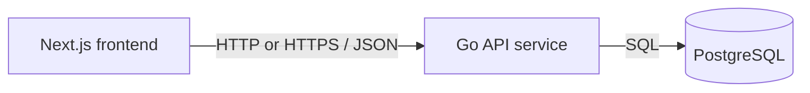

# Service & Interface Design — Task board for one person

Last updated: 2026-08-17
Source: `docs/tasks/SRS.md`, `docs/architecture/erd.md`, `docs/architecture/overview.md`

## 1. Service map



| Service | Responsibility | Owns (tables) | Depends on | Deploy unit |
|---|---|---|---|---|
| Go API service | Own REST contract, validate task input, run migrations, read/write persisted task state, return safe JSON errors | `tasks` | PostgreSQL | `code/backend` container |
| Next.js frontend | Render one board screen, call API, display loading/error/validation states, never persist task truth in browser storage | none | Go API service | `code/frontend` container |
| PostgreSQL | Durable storage for task rows | physical `tasks` data | none | database service |

**Why these boundaries** — single backend service: no split justified yet. One module, one aggregate, one table, one deploy cadence. Next.js and Go remain separate deploy units because UI build/runtime differs from API/database runtime.

Entity ownership:

| Entity | Owning service | Write path |
|---|---|---|
| `tasks` | Go API service | Only through `POST /api/v1/tasks`, `PATCH /api/v1/tasks/{task_id}`, and `DELETE /api/v1/tasks/{task_id}` |

No other service may write `tasks`. Frontend reads and writes only through Go API service.

## 2. Cross-cutting contract

### 2.1 Base

- Base URL: `{scheme}://{host}/api/v1`
- Content type: `application/json; charset=utf-8`
- Versioning: URL path major version. A new major version only for breaking changes.
- Trace header: `X-Request-Id` accepted from caller, generated if absent, echoed on every response and present in every backend log line.
- Date format: `YYYY-MM-DD` calendar date, no time and no timezone.
- Timestamp format: RFC 3339 UTC, for `created_at` and `updated_at`.
- ID format: UUID string.
- JSON naming: `snake_case`.
- Task status enum: closed set `todo`, `doing`, `done`. Clients must treat unknown values in responses as invalid API data and show API error state, not render extra columns.

### 2.2 Authentication and authorization

| Aspect | Decision |
|---|---|
| Mechanism | None. Product is one private single-person board; sign-in, sessions, accounts, users, and roles are out of scope. |
| Token lifetime | n/a |
| Refresh | n/a |
| Transport | No `Authorization` header required or accepted for behavior. |
| Roles | One implicit Board owner actor. |
| Enforcement point | Per-handler no-auth decision; handlers do not derive or accept `user_id`, `board_id`, role, account, or membership fields. |

Every endpoint is available to implicit Board owner. Adding auth later is breaking product scope and contract change unless new endpoints/version are added.

### 2.3 Error contract

Every non-2xx response, from every endpoint, has this shape:

```json
{
  "error": {
    "code": "VALIDATION_FAILED",
    "message": "Human-readable summary, safe to show a user.",
    "details": [
      { "field": "title", "code": "REQUIRED", "message": "Title is required." }
    ],
    "request_id": "01HX0000000000000000000000"
  }
}
```

Rules:

- Consumers branch on `error.code`, and for field UI may branch on `details[].field` plus `details[].code`.
- `message` and `details[].message` are safe display text and may be reworded without contract change.
- `details` is an empty array when no field-specific detail exists.
- Backend never returns SQL, stack traces, file paths, internal hostnames, or raw driver errors.
- `X-Request-Id` response header equals `error.request_id` on errors.

**Error catalog** — closed set for this project.

| Code | HTTP | Meaning | Retryable |
|---|---|---|---|
| `BAD_REQUEST` | 400 | Request is malformed JSON, has wrong JSON type, has unsupported content type, or path/query syntax is invalid | no |
| `VALIDATION_FAILED` | 422 | Request is well-formed but fields fail validation | no |
| `NOT_FOUND` | 404 | Task does not exist | no |
| `RATE_LIMITED` | 429 | Too many requests; caller should honor `Retry-After` | yes |
| `INTERNAL` | 500 | Unexpected server failure; details logged by `request_id` only | yes |
| `UNAVAILABLE` | 503 | API is draining, database is down, migration failed, or dependency timeout occurred | yes |

Field detail codes:

| Field | Detail code | Meaning |
|---|---|---|
| `title` | `REQUIRED` | Missing or blank after trimming |
| `title` | `TOO_LONG` | More than 120 characters after trimming |
| `description` | `TOO_LONG` | More than 2,000 characters after trimming |
| `status` | `REQUIRED` | Missing on create when no default applies internally or null in update |
| `status` | `INVALID_ENUM` | Not exactly `todo`, `doing`, or `done` |
| `due_date` | `INVALID_DATE` | Not `YYYY-MM-DD` or not a real calendar date |
| `task_id` | `INVALID_UUID` | Path ID is not UUID syntax |
| `body` | `MALFORMED_JSON` | JSON cannot be parsed |
| `body` | `UNKNOWN_FIELD` | JSON has fields outside endpoint schema |
| `body` | `EMPTY_PATCH` | PATCH body omits every editable field |

### 2.4 Pagination

Task board must show every task on one page. Launch data is single-person and expected small, but contract still caps list size.

```http
GET /api/v1/tasks?limit=200&cursor=2026-08-17T10%3A00%3A00Z%2C550e8400-e29b-41d4-a716-446655440000
```

```json
{
  "tasks": [
    {
      "id": "550e8400-e29b-41d4-a716-446655440000",
      "title": "Pay invoice",
      "description": null,
      "status": "todo",
      "due_date": null,
      "created_at": "2026-08-17T10:00:00Z",
      "updated_at": "2026-08-17T10:00:00Z"
    }
  ],
  "next_cursor": null,
  "has_more": false
}
```

| Aspect | Decision |
|---|---|
| Style | Cursor, to stay stable if tasks are created while list is loaded. |
| Default limit | 200 |
| Max limit | 200 |
| Default sort | `created_at ASC, id ASC`; stable and unique with `id` tiebreaker. |
| Cursor format | Opaque to clients. Current server encoding may be base64url JSON or comma pair; clients must only pass returned `next_cursor` back unchanged. |
| Filtering | None. Search, labels, boards, users, and archive filters are out of scope. |

For current board UI, first page with default `limit=200` is expected. If `has_more` is true, frontend may fetch next pages until false before rendering complete board, or show API error if full board cannot be loaded. Browser storage must never fill gaps.

### 2.5 Validation boundary

Validation boundary is Go API HTTP handler layer, before repository/database calls.

At this boundary, handlers validate and normalize:

- `Content-Type` is `application/json` for requests with body.
- Body size max 16 KiB.
- JSON is an object, not array/scalar.
- Unknown JSON fields are rejected.
- `task_id` path parameter is UUID syntax.
- `title` and `description` are trimmed before validation and storage.
- Blank `description` becomes `null`.
- Blank `due_date` from JSON must be sent as `null`; non-null due date must be valid `YYYY-MM-DD` calendar date.
- `status` must be one of `todo`, `doing`, `done`.

Downstream repository code may trust validated handler inputs. Database constraints remain final integrity guard, not user-facing validation layer.

### 2.6 Idempotency

| Endpoint | Accepts `Idempotency-Key` | Behavior |
|---|---|---|
| `POST /api/v1/tasks` | Yes, optional | If provided, key is retained in process memory for 10 minutes and scoped to method + path + request body hash. Replay with same body returns same `201` response and `Location`. Replay with different body returns `VALIDATION_FAILED`. Best-effort only; process restart may forget keys. |
| `PATCH /api/v1/tasks/{task_id}` | No | Last successful save wins per SRS. Caller may retry only after refreshing task state. |
| `DELETE /api/v1/tasks/{task_id}` | No | HTTP method is idempotent by semantics only for existing row; this API returns `204` on first delete and `NOT_FOUND` on later delete so UI can refresh. |

No persistent idempotency table exists because one-table scope is fixed by stakeholder. Best-effort create idempotency avoids common double-submit without adding schema.

## 3. Endpoints

Shared task object:

```json
{
  "id": "550e8400-e29b-41d4-a716-446655440000",
  "title": "Pay invoice",
  "description": "Due before Friday",
  "status": "todo",
  "due_date": "2026-08-31",
  "created_at": "2026-08-17T10:00:00Z",
  "updated_at": "2026-08-17T10:00:00Z"
}
```

| Field | Type | Nullable | Description |
|---|---|---|---|
| `id` | string UUID | no | Stable task identifier. |
| `title` | string | no | Trimmed title, 1 to 120 characters. |
| `description` | string | yes | Trimmed description, null when absent. |
| `status` | string enum | no | `todo`, `doing`, or `done`. |
| `due_date` | string date | yes | `YYYY-MM-DD`, null when absent. |
| `created_at` | string timestamp | no | RFC 3339 UTC creation time. |
| `updated_at` | string timestamp | no | RFC 3339 UTC last write time. |

### 3.1 `GET /api/v1/tasks`

**Purpose** — Load persisted tasks for board display. **Traces to** — TASKS-001, TASKS-004. **Auth** — implicit Board owner; no credentials.

**Path / query parameters**

| Name | In | Type | Required | Constraints | Description |
|---|---|---|---|---|---|
| `limit` | query | integer | no | 1 to 200; default 200 | Max tasks returned in one page. |
| `cursor` | query | string | no | Must be cursor previously returned by this endpoint | Continue after previous page. |

**Request body**

None. Request with body is ignored only if empty; non-empty body returns `BAD_REQUEST`.

**Success response** — `200`

```json
{
  "tasks": [
    {
      "id": "550e8400-e29b-41d4-a716-446655440000",
      "title": "Pay invoice",
      "description": "Due before Friday",
      "status": "todo",
      "due_date": "2026-08-31",
      "created_at": "2026-08-17T10:00:00Z",
      "updated_at": "2026-08-17T10:00:00Z"
    }
  ],
  "next_cursor": null,
  "has_more": false
}
```

| Field | Type | Nullable | Description |
|---|---|---|---|
| `tasks` | array of task objects | no | Tasks sorted by `created_at ASC, id ASC`. Empty array when no tasks exist. |
| `next_cursor` | string | yes | Cursor for next page; null when no next page. |
| `has_more` | boolean | no | True when caller should request next page for complete board. |

**Errors** — every code this endpoint can return. No others.

| Code | HTTP | Trigger |
|---|---|---|
| `BAD_REQUEST` | 400 | `limit` is not an integer, outside 1..200, cursor is malformed, unsupported method body is non-empty, or query parameter is unsupported. |
| `RATE_LIMITED` | 429 | Request exceeds rate limit. |
| `INTERNAL` | 500 | Unexpected server failure. |
| `UNAVAILABLE` | 503 | Database unavailable, migrations not ready, or request timed out before DB returned. |

**Notes** — No side effects. No browser storage fallback allowed. Counts for Todo/Doing/Done may be computed client-side from returned tasks. API returns only persisted database rows; if database contains invalid status despite constraints, API returns `INTERNAL` and logs corrupt row IDs by `request_id`.

### 3.2 `POST /api/v1/tasks`

**Purpose** — Create persisted task. **Traces to** — TASKS-002. **Auth** — implicit Board owner; no credentials.

Reviewed UI mock module `code/frontend/lib/mock/create-task.ts` uses `TaskCreateRequest` with `title`, optional `description`, optional `status`, and optional `due_date`; saved `Task` response with `id`, `title`, `description`, `status`, `due_date`, `created_at`, and `updated_at`; list envelope `{ tasks, next_cursor, has_more }`; and project error envelope `{ error: { code, message, details, request_id } }`. API matches field names, nullability, list envelope, and error shape. No frontend contract deviation needed.

**Path / query parameters**

| Name | In | Type | Required | Constraints | Description |
|---|---|---|---|---|---|
| none | n/a | n/a | n/a | n/a | n/a |

**Request body**

```json
{
  "title": "Pay invoice",
  "description": "Due before Friday",
  "status": "todo",
  "due_date": "2026-08-31"
}
```

| Field | Type | Required | Constraints | Description |
|---|---|---|---|---|
| `title` | string | yes | Trimmed length 1 to 120 | Task title. |
| `description` | string or null | no | Trimmed length 0 to 2,000; blank string stored as null | Optional description. |
| `status` | string enum | no | `todo`, `doing`, `done`; default `todo` when omitted | Initial status. |
| `due_date` | string date or null | no | `YYYY-MM-DD` valid calendar date | Optional due date. |

Unknown fields are rejected.

**Success response** — `201`

Headers:

```http
Location: /api/v1/tasks/550e8400-e29b-41d4-a716-446655440000
```

```json
{
  "id": "550e8400-e29b-41d4-a716-446655440000",
  "title": "Pay invoice",
  "description": "Due before Friday",
  "status": "todo",
  "due_date": "2026-08-31",
  "created_at": "2026-08-17T10:00:00Z",
  "updated_at": "2026-08-17T10:00:00Z"
}
```

| Field | Type | Nullable | Description |
|---|---|---|---|
| `id` | string UUID | no | Generated task ID. |
| `title` | string | no | Stored trimmed title. |
| `description` | string | yes | Stored trimmed description or null. |
| `status` | string enum | no | Stored status. |
| `due_date` | string date | yes | Stored due date or null. |
| `created_at` | string timestamp | no | Creation timestamp. |
| `updated_at` | string timestamp | no | Same as creation timestamp on insert. |

**Errors** — every code this endpoint can return. No others.

| Code | HTTP | Trigger |
|---|---|---|
| `BAD_REQUEST` | 400 | Missing/unsupported `Content-Type`, malformed JSON, body not object, body exceeds 16 KiB, wrong JSON type, or unknown field. |
| `VALIDATION_FAILED` | 422 | Title blank or too long; description too long; status invalid; due date invalid; idempotency replay body differs for same key. |
| `RATE_LIMITED` | 429 | Request exceeds rate limit. |
| `INTERNAL` | 500 | Unexpected server failure. |
| `UNAVAILABLE` | 503 | Database unavailable, migrations not ready, or request timed out before DB commit. |

**Notes** — Optional `Idempotency-Key` supported as described in section 2.6. Duplicate titles are allowed. API trims title and description before storage. Blank `description` and blank `due_date` normalize to `null`. API returns saved row and frontend must update board from response, not optimistic unconfirmed state.

Migration plan for this story:

| Step | Forward | Backward | Safe on populated table |
|---|---|---|---|
| Create task API | Add handler/repository code using existing `tasks` table; no schema migration. | Remove handler/repository code or stop routing `POST /api/v1/tasks`; no data rollback required. Created task rows may remain as normal `tasks` records. | Yes; no DDL, no data rewrite. Existing rows unaffected. |

### 3.3 `PATCH /api/v1/tasks/{task_id}`

**Purpose** — Edit task fields and move task between statuses. **Traces to** — TASKS-003, TASKS-004. **Auth** — implicit Board owner; no credentials.

Reviewed UI mock module `code/frontend/lib/mock/edit-and-move-task.ts` already uses same saved task shape and same error envelope as this endpoint. No frontend contract deviation needed.

**Path / query parameters**

| Name | In | Type | Required | Constraints | Description |
|---|---|---|---|---|---|
| `task_id` | path | string UUID | yes | Valid UUID syntax | Task to update. |

**Request body**

```json
{
  "title": "Final",
  "description": null,
  "status": "done",
  "due_date": null
}
```

| Field | Type | Required | Constraints | Description |
|---|---|---|---|---|
| `title` | string | no | Trimmed length 1 to 120 when present | Replace title. Omit to leave unchanged. |
| `description` | string or null | no | Trimmed length 0 to 2,000; blank string stored as null | Replace or clear description. Omit to leave unchanged. |
| `status` | string enum | no | `todo`, `doing`, `done` | Replace status. Omit to leave unchanged. |
| `due_date` | string date or null | no | `YYYY-MM-DD` valid calendar date | Replace or clear due date. Omit to leave unchanged. |

At least one editable field must be present. Unknown fields are rejected. Omitted means unchanged; null means clear only for nullable fields `description` and `due_date`. `title: null` and `status: null` return `BAD_REQUEST` because type is wrong.

**Success response** — `200`

```json
{
  "id": "550e8400-e29b-41d4-a716-446655440000",
  "title": "Final",
  "description": null,
  "status": "done",
  "due_date": null,
  "created_at": "2026-08-17T10:00:00Z",
  "updated_at": "2026-08-17T10:05:00Z"
}
```

| Field | Type | Nullable | Description |
|---|---|---|---|
| `id` | string UUID | no | Target task ID. |
| `title` | string | no | Stored trimmed title. |
| `description` | string | yes | Stored trimmed description or null. |
| `status` | string enum | no | Stored status after edit/move. |
| `due_date` | string date | yes | Stored due date or null. |
| `created_at` | string timestamp | no | Original creation timestamp. |
| `updated_at` | string timestamp | no | Last write timestamp after update. |

**Errors** — every code this endpoint can return. No others.

| Code | HTTP | Trigger |
|---|---|---|
| `BAD_REQUEST` | 400 | Invalid UUID syntax; missing/unsupported `Content-Type`; malformed JSON; body not object; body exceeds 16 KiB; wrong JSON type; unknown field. |
| `VALIDATION_FAILED` | 422 | Empty patch; title blank or too long; description too long; status invalid; due date invalid. |
| `NOT_FOUND` | 404 | No task exists for `task_id`. |
| `RATE_LIMITED` | 429 | Request exceeds rate limit. |
| `INTERNAL` | 500 | Unexpected server failure. |
| `UNAVAILABLE` | 503 | Database unavailable, migrations not ready, or request timed out before DB commit. |

**Notes** — Last successful save wins. No optimistic concurrency token in scope because multi-user conflict handling and activity history are out of scope. Frontend must update card/column/counts from returned saved task. On failure, frontend keeps last confirmed saved values. Move controls may send `{ "status": "doing" }` only; edit modal may send all edited fields.

### 3.4 `DELETE /api/v1/tasks/{task_id}`

**Purpose** — Delete persisted task. **Traces to** — TASKS-005. **Auth** — implicit Board owner; no credentials.

**Path / query parameters**

| Name | In | Type | Required | Constraints | Description |
|---|---|---|---|---|---|
| `task_id` | path | string UUID | yes | Valid UUID syntax | Task to delete. |

**Request body**

None. Request with body is ignored only if empty; non-empty body returns `BAD_REQUEST`.

**Success response** — `204`

No response body.

| Field | Type | Nullable | Description |
|---|---|---|---|
| none | n/a | n/a | n/a |

**Errors** — every code this endpoint can return. No others.

| Code | HTTP | Trigger |
|---|---|---|
| `BAD_REQUEST` | 400 | Invalid UUID syntax or non-empty request body. |
| `NOT_FOUND` | 404 | No task exists for `task_id`, including repeated delete after row was already removed. |
| `RATE_LIMITED` | 429 | Request exceeds rate limit. |
| `INTERNAL` | 500 | Unexpected server failure. |
| `UNAVAILABLE` | 503 | Database unavailable, migrations not ready, or request timed out before DB commit. |

**Notes** — UI confirmation happens before calling API. Cancelled delete sends no API request. Delete is hard delete; no soft-delete, archive, undo, or activity log exists. On 204, frontend removes task from board. On `NOT_FOUND`, frontend shows not-found message and refreshes list from API.

### 3.5 `GET /healthz`

**Purpose** — Runtime health for container and local run checks. **Traces to** — Architecture overview health requirement, supports all TASKS persistence requirements. **Auth** — none.

**Path / query parameters**

| Name | In | Type | Required | Constraints | Description |
|---|---|---|---|---|---|
| none | n/a | n/a | n/a | n/a | n/a |

**Request body**

None.

**Success response** — `200`

```json
{
  "status": "ok"
}
```

| Field | Type | Nullable | Description |
|---|---|---|---|
| `status` | string | no | Always `ok` when healthy. |

**Errors** — every code this endpoint can return. No others.

| Code | HTTP | Trigger |
|---|---|---|
| `UNAVAILABLE` | 503 | Migrations have not succeeded, database `SELECT 1` fails, or server is shutting down. |

**Notes** — Not under `/api/v1` because it is operational, not product API. It must not expose database URL, migration list, or internal errors.

## 4. Asynchronous work

No jobs, queues, schedules, or events in scope.

| Name | Trigger | Payload | Retry | Backoff | Dead letter | Idempotent |
|---|---|---|---|---|---|---|
| none | n/a | n/a | n/a | n/a | n/a | n/a |

## 5. External integrations

No third-party integrations in scope. No secrets or provider setup required by this contract.

| System | Purpose | Protocol | Timeout | Retry | On failure | Secrets |
|---|---|---|---|---|---|---|
| PostgreSQL | Persist and load task rows | SQL over database driver | 2s per query inside 5s inbound request timeout | No automatic retry for writes; reads may retry once only before response if connection acquisition fails before query starts | User sees API error state or save/delete failure; frontend keeps last confirmed saved data and offers retry where SRS requires | `DATABASE_URL` already documented in `code/backend/.env.example` |

Cross-service calls:

| Caller | Callee | Mode | Timeout | Retry policy | Idempotency key | On failure |
|---|---|---|---|---|---|---|
| Next.js frontend | Go API service | Synchronous HTTP JSON from browser | 5s request timeout per call | GET list retry only when Board owner uses retry action; create/update/delete not auto-retried by UI after unknown outcome | Optional `Idempotency-Key` only for create double-submit protection | Show API error, validation error, not-found message, or save/delete failure per SRS; never use browser storage as persisted substitute |
| Go API service | PostgreSQL | Synchronous SQL | 2s DB operation deadline within 5s inbound request timeout | No write retry. Read may retry once if failure occurs before query execution. | None; DB transaction plus primary key/constraints guard integrity | Return `UNAVAILABLE` for dependency outage/timeout or `INTERNAL` for unexpected error; log details by `request_id` |

## 6. Non-functional targets

| Aspect | Target |
|---|---|
| p95 latency (read) | `GET /api/v1/tasks` under 500ms for 200 tasks on local development after API process is warm and DB is reachable. |
| p95 latency (write) | Create, patch, and delete under 500ms on local development after API process is warm and DB is reachable. |
| Availability | Single private deployment; health returns 503 until DB and migrations are ready. No offline mode. |
| Rate limit | Per client IP: 120 requests/minute, burst 30. Return `RATE_LIMITED` with `Retry-After`. Local/dev may disable only by explicit env config documented in `.env.example`. |
| Payload cap | 16 KiB JSON body per write request. |
| Timeout (inbound) | 5s per HTTP request; graceful shutdown stops accepting new requests and lets in-flight requests finish within 10s. |
| Board size | API supports at least 200 tasks on first page for SRS performance target. |
| Persistence | All task truth comes from PostgreSQL through Go API. Browser storage is never source of truth. |

## 7. Observability

Every backend request log line includes:

- `request_id`
- HTTP method
- path template, not raw path when possible
- status code
- duration
- response bytes
- remote address or forwarded client IP when trusted proxy config exists
- error code for non-2xx responses

Metrics per endpoint:

- request count by method, path template, status code, and error code
- request duration histogram by method and path template
- database operation duration and error count by operation name (`list_tasks`, `create_task`, `update_task`, `delete_task`, `health_check`)

Never logged:

- secrets, tokens, passwords, `DATABASE_URL`
- full request bodies
- full task title or description text
- SQL strings with interpolated values

Task IDs may be logged. User-entered due dates and statuses may be logged only as structured fields if needed for debugging validation, not on every success path.

## 8. Contract evolution

| Change | Additive or breaking | Migration path |
|---|---|---|
| Add new optional response field, for example `completed_at` | Additive if omitted clients still work | Add nullable DB column, return field only after frontend ignores unknown fields. |
| Add new endpoint | Additive | Document endpoint, implement behind `/api/v1`; no existing client change required. |
| Add new task status enum value | Breaking | Requires new major version or staged UI first; current client must not render fourth column and treats unknown status as API error. |
| Change title or description length limits | Breaking if tighter; additive if looser within DB/UI support | For tighter limit, add UI migration and data cleanup before API enforcement. |
| Add authentication, users, boards, or ownership | Breaking product scope | New SRS, ERD, service design; likely `/api/v2` or parallel auth-aware endpoints with migration plan. |
| Change due date from date-only to timestamp/timezone | Breaking | New field or versioned endpoint; migrate UI display and DB type safely. |
| Change `DELETE` not-found behavior from 404 to 204 | Breaking | Versioned endpoint or deprecation period because UI branches on not-found refresh behavior. |
| Rename JSON fields or switch casing | Breaking | New major API version; keep old version until known frontend migrated. |

One-Version Rule: keep only `/api/v1` live unless a breaking product expansion makes parallel migration unavoidable.

## 9. Requirement traceability

| SRS requirement | Endpoint coverage | Notes |
|---|---|---|
| TASKS-001 — Load persisted tasks into three status columns | `GET /api/v1/tasks` | Returns all persisted task fields needed for cards and status grouping. |
| TASKS-002 — Create persisted task | `POST /api/v1/tasks`, `GET /api/v1/tasks` | Create returns saved task; reload uses list. |
| TASKS-003 — Edit persisted task fields | `PATCH /api/v1/tasks/{task_id}`, `GET /api/v1/tasks` | Patch updates title, description, due date, and may include status. Reload uses list. |
| TASKS-004 — Move persisted task between statuses | `PATCH /api/v1/tasks/{task_id}`, `GET /api/v1/tasks` | Patch updates status; returned task drives column and counts. Reload uses list. |
| TASKS-005 — Delete persisted task | `DELETE /api/v1/tasks/{task_id}`, `GET /api/v1/tasks` | Delete removes row; reload uses list to prove absence. |

Endpoint-to-requirement coverage:

| Endpoint | Requirement(s) |
|---|---|
| `GET /api/v1/tasks` | TASKS-001, TASKS-002, TASKS-003, TASKS-004, TASKS-005 |
| `POST /api/v1/tasks` | TASKS-002 |
| `PATCH /api/v1/tasks/{task_id}` | TASKS-003, TASKS-004 |
| `DELETE /api/v1/tasks/{task_id}` | TASKS-005 |
| `GET /healthz` | Architecture runtime health; supports all task requirements by preventing false healthy state without DB |

## 10. Story extension — Create task

Mock contract read from approved UI PR:

- `code/frontend/lib/mock/create-task.ts` exposes `Task` with `id`, `title`, `description`, `status`, `due_date`, `created_at`, `updated_at`.
- `TaskCreateRequest` is `{ title, description?, status?, due_date? }`.
- `TaskListResponse` is `{ tasks, next_cursor, has_more }`.
- `ApiErrorResponse` is project error envelope `{ error: { code, message, details, request_id } }` with create endpoint codes `BAD_REQUEST`, `VALIDATION_FAILED`, `RATE_LIMITED`, `INTERNAL`, and `UNAVAILABLE`.

API contract matches mock fields, nullability, list envelope, and error shape. No frontend rework needed for contract shape. Only behavior changes when backend replaces mock: `POST /api/v1/tasks` becomes persisted source of truth.

Migration plan for this story:

| Step | Forward | Backward | Safe on populated table |
|---|---|---|---|
| Create task API | Add handler/repository code using existing `tasks` table; no schema migration. | Remove handler/repository code or stop routing `POST /api/v1/tasks`; no data rollback required. Created task rows may remain as normal `tasks` records. | Yes; no DDL, no data rewrite. Existing rows unaffected. |

## 11. Story extension — Edit and move task

Mock contract read from approved UI PR:

- `code/frontend/lib/mock/edit-and-move-task.ts` exposes `Task` with `id`, `title`, `description`, `status`, `due_date`, `created_at`, `updated_at`.
- `TasksResponse` is `{ tasks, next_cursor, has_more }`.
- `ApiError` is project error envelope `{ error: { code, message, details, request_id } }`.

API contract matches mock fields, nullability, list envelope, and error shape. No frontend rework needed for contract shape. Only behavior changes when backend replaces mock: `PATCH /api/v1/tasks/{task_id}` becomes persisted source of truth.

Migration plan for this story:

| Step | Forward | Backward | Safe on populated table |
|---|---|---|---|
| Edit and move API | Add handler/repository code using existing `tasks` table; no schema migration. | Remove handler/repository code or stop routing PATCH; no data rollback required. | Yes; no DDL, no data rewrite. Existing rows keep values. |

## 12. Open questions

| Question | Owner | Blocking |
|---|---|---|
| none | n/a | no |
